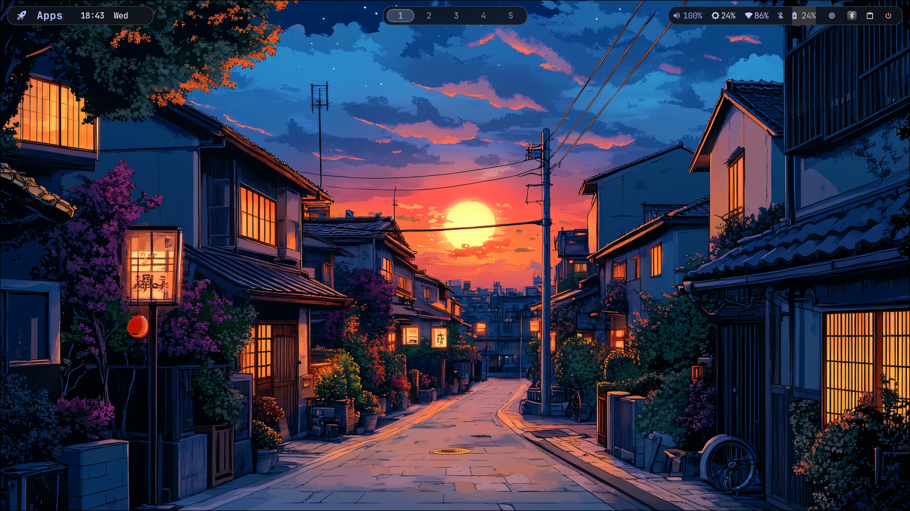
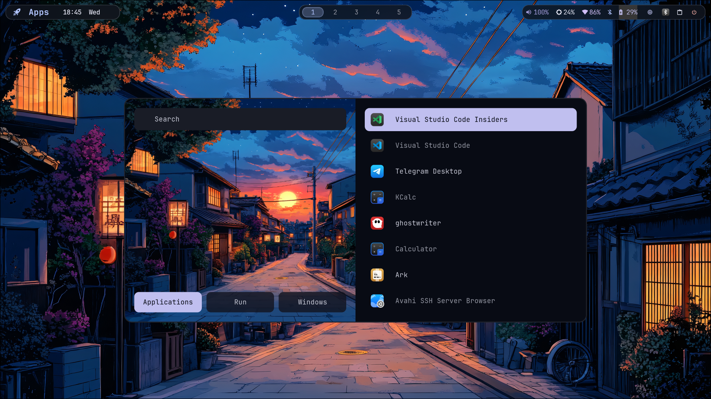
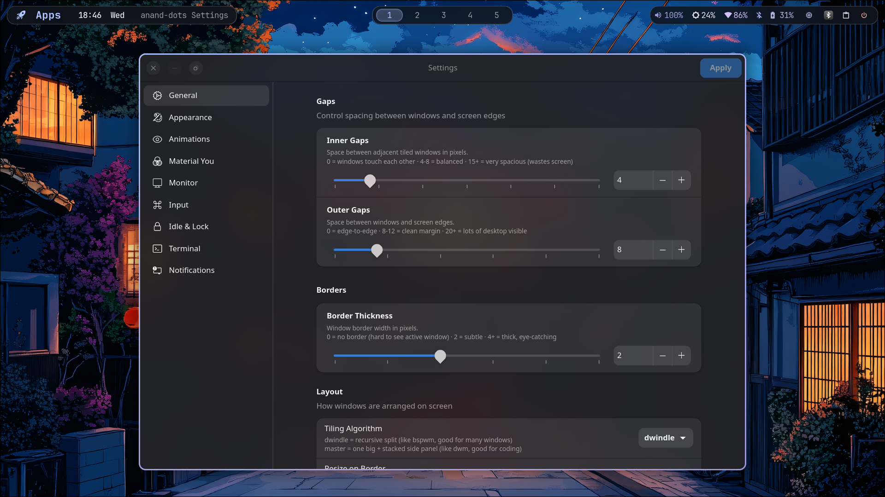

<div align="center">

# anand-dots

**A production-grade Hyprland desktop for Arch Linux**  
Powered by Material You dynamic colors extracted from your wallpaper.

[](https://hyprland.org)
[](https://archlinux.org)
[](#-material-you-color-engine)
[](LICENSE)

</div>

---

## Screenshots




<!--  -->

---

## Table of Contents

- [Features](#-features)
- [Components](#-components)
- [Installation](#-installation)
- [Uninstall](#-uninstall)
- [Material You Color Engine](#-material-you-color-engine)
- [Settings GUI](#-settings-gui)
- [Keybindings](#-keybindings)
- [File Structure](#-file-structure)
- [Customization](#-customization)
- [Troubleshooting](#-troubleshooting)

---

## ✨ Features

- **Wallpaper-driven theming** — set a wallpaper and the entire desktop recolors itself instantly using Material Design 3 color science
- **Production Material You engine** — dominant color extraction, chroma boosting, tone correction, terminal harmonization, accent palette
- **Settings GUI** — GTK4/Libadwaita app to configure everything visually without touching a config file
- **Modular Hyprland config** — each concern in its own file (monitors, keybindings, rules, animations)
- **Floating pill Waybar** — modern transparent status bar with hardware monitoring group
- **Per-app window rules** — smart floating, workspace assignment, opacity for common apps
- **Idle + lock pipeline** — screen dim → lock → DPMS off → suspend, all configurable
- **Clipboard history** — `cliphist` with Rofi picker
- **Gamemode toggle** — one keybind to disable all visual effects for gaming
- **Full keyboard workflow** — vim-style focus/move, workspace cycling, resize mode

---

## Components

| Component | Tool |
|-----------|------|
| Window Manager | [Hyprland](https://hyprland.org) |
| Status Bar | [Waybar](https://github.com/Alexays/Waybar) |
| Terminal | [Kitty](https://sw.kovidgoyal.net/kitty/) |
| Shell | zsh |
| Prompt | [Oh My Posh](https://ohmyposh.dev) |
| Launcher | [Rofi](https://davatorium.github.io/rofi/) |
| Notifications | [Mako](https://github.com/emersion/mako) |
| Lock Screen | [hyprlock](https://github.com/hyprwm/hyprlock) |
| Idle Daemon | [hypridle](https://github.com/hyprwm/hypridle) |
| Wallpaper Engine | [swww](https://github.com/LGFae/swww) |
| Wallpaper Picker | [waypaper](https://github.com/anufrievroman/waypaper) |
| Color Engine | [matugen](https://github.com/InioX/matugen) |
| Screenshots | grim + slurp |
| Clipboard | cliphist + wl-clipboard |
| File Manager | [Nautilus](https://gitlab.gnome.org/GNOME/nautilus) |
| Browser | Firefox |
| System Info | [fastfetch](https://github.com/fastfetch-cli/fastfetch) |
| Settings GUI | GTK4 / Libadwaita (built-in) |
| Power Menu | [wlogout](https://github.com/ArtsyMacaw/wlogout) |

---

## 🚀 Installation

### Prerequisites

- Arch Linux (or an Arch-based distro)
- A working `pacman` setup — `yay` or `paru` will be installed automatically if missing
- A display manager or TTY login that can launch Hyprland

### Quick Install

```bash
git clone https://github.com/Anandqwe/anand-dots.git
cd anand-dots
chmod +x install.sh
./install.sh
```

The installer runs **interactively** and prompts before each step. Answer `y` to each step for a full install.

### Non-interactive Install

Run all steps without prompts:

```bash
./install.sh -a
```

### Selective Install

You can run individual steps with flags:

```
./install.sh [flags]

  -p   Install packages  (pacman + AUR)
  -d   Create directories and copy bundled wallpapers
  -c   Symlink configs to ~/.config/
  -s   Symlink scripts and make them executable
  -t   Apply Material You colors from wallpaper
  -a   All steps (non-interactive)
  -h   Show help
```

Example — re-link configs only after updating dotfiles:
```bash
./install.sh -c
```

### What the Installer Does

| Step | What happens |
|------|-------------|
| **1. Dependencies** | Checks `base-devel`; detects or installs `yay`/`paru`; warns about NVIDIA |
| **2. Packages** | Installs all packages from `packages.txt` via pacman + AUR helper |
| **3. Directories** | Creates `~/Pictures/Screenshots`, `~/Pictures/Wallpapers`, `~/.cache/anand-dots`; copies bundled wallpapers |
| **4. Configs** | Backs up any existing configs as `*.bak.TIMESTAMP`, then symlinks dotfile configs to `~/.config/` |
| **5. Scripts** | Symlinks `scripts/` to `~/.config/hypr/scripts/`; makes all `.sh` files and `settings/main.py` executable |
| **6. Colors** | Runs `matugen-apply.sh` on the first available wallpaper to generate an initial theme |
| **7. Services** | Enables bluetooth systemd service |
| **8. Summary** | Prints starter keybinds and next steps |

All output is logged to `install-logs/install-TIMESTAMP.log`.

### After Installation

1. Log out and select **Hyprland** from your display manager, or if already in Hyprland:
   ```bash
   hyprctl reload
   ```
2. Put your wallpapers in `~/Pictures/Wallpapers/`
3. Press `SUPER+SHIFT+W` to open the wallpaper picker — selecting a wallpaper auto-applies colors
4. Press `SUPER+CTRL+S` to open the Settings GUI

> **Note:** The Python Settings GUI requires `python-gobject`, `libadwaita`, and `gtk4`. These are installed automatically by the install script.

---

## 🗑️ Uninstall

```bash
chmod +x uninstall.sh
./uninstall.sh
```

The uninstall script:

1. **Removes symlinks** — all config symlinks from `~/.config/` are deleted
2. **Restores backups** — if a `*.bak.TIMESTAMP` backup exists it is automatically moved back
3. **Optionally removes packages** — lists everything from `packages.txt` and asks before removing
4. **Optionally removes directories** — asks before deleting `~/Pictures/Wallpapers`, `~/Pictures/Screenshots`, `~/.cache/anand-dots`

Everything is logged to `install-logs/uninstall-TIMESTAMP.log`.

> **Safe by default** — package removal and directory deletion both require explicit `y` confirmation.

---

## 🎨 Material You Color Engine

Colors are **automatically extracted from your wallpaper** using [matugen](https://github.com/InioX/matugen) and Material Design 3 color science. Every time you change your wallpaper the entire desktop — borders, bars, terminal, launcher, notifications, lock screen — recolors itself to match.

### Pipeline

```
Wallpaper
   │
   ├─ ImageMagick ──► Dominant color extraction (top 3 chromatic colors)
   │                  Saturation check → scheme-neutral or scheme-vibrant
   │
   ├─ matugen ──────► Full Material You palette
   │                  color hex "#dominant" → seeded from real image colors
   │
   ├─ boost_color ──► Chroma boost (S < 0.60 → ×1.20, max 0.85)
   │                  Tone correction (L < 0.60 → lifted to 0.65)
   │
   ├─ mix_hex ──────► Derived UI states: hover / active / dim
   │                  Multi-accent blending: dom2→secondary, dom3→tertiary
   │                  Background tint (1% primary in surface)
   │
   ├─ harmonize_hex ► Terminal palette (ANSI colors harmonized toward primary)
   │
   └─ theme.conf ───► Hyprland + Waybar + Kitty + Rofi + Mako + Hyprlock
```

### Variables Written to `theme.conf`

Every component sources `~/.config/hypr/theme.conf`. It contains:

**Primary palette**
```ini
$primary   $secondary   $tertiary
```

**Fixed variants** — tone-stable vivid accents (contrast-safe)
```ini
$primary_fixed    $primary_fixed_dim
$secondary_fixed  $secondary_fixed_dim
$tertiary_fixed   $tertiary_fixed_dim
```

**Surfaces** — full hierarchy from darkest to brightest
```ini
$background  $background_tinted  $surface  $surface_dim  $surface_bright  $surface_variant
$surface_container_lowest  $surface_container_low  $surface_container
$surface_container_high    $surface_container_highest
```

**Text & outlines**
```ini
$on_surface  $on_surface_variant  $outline  $outline_variant
$inverse_primary  $inverse_surface  $scrim
```

**Semantic**
```ini
$error  $error_container
```

**Derived interaction states**
```ini
$primary_hover   $primary_active   $primary_dim
$secondary_hover $secondary_active
```

**Accent palette** — for syntax highlighting, rainbow delimiters, etc.
```ini
$accent1 → $accent9   (primary → tertiary → *_fixed → *_fixed_dim)
```

**Terminal harmony palette** — ANSI colors harmonized toward the primary accent
```ini
$term_bg   $term_fg   $term_color0 → $term_color15
```

**Compatibility aliases** — keeps existing configs working
```ini
$blue  $green  $red  $mauve  $text  $base  $surface0 …  (catppuccin-style names)
```

### Scheme Styles

Change the color generation algorithm via the **Settings GUI** (`SUPER+CTRL+S` → Material You) or:
```bash
echo "scheme-expressive" > ~/.cache/anand-dots/scheme-type
~/.config/hypr/scripts/matugen-apply.sh ~/Pictures/Wallpapers/mywallpaper.jpg
```

| Style | Description |
|-------|-------------|
| `scheme-vibrant` | **Default** — rich saturated colors, best for ricing |
| `scheme-expressive` | Most colorful; tertiary hue shifts furthest from primary |
| `scheme-tonal-spot` | Android's default — balanced, moderate saturation |
| `scheme-fidelity` | Closest to wallpaper's actual colors |
| `scheme-content` | Similar to fidelity, more toned-down |
| `scheme-fruit-salad` | Unique color mixing algorithm |
| `scheme-rainbow` | High variety across all tonal roles |
| `scheme-neutral` | Very muted, near-monochrome — clean minimal look |
| `scheme-monochrome` | Pure grayscale palette |

> **Smart auto-detection:** When `scheme-vibrant` or `scheme-expressive` is set, the engine automatically  
> detects low-saturation wallpapers and switches to `scheme-neutral` — your preference is preserved in cache.

### Manual Re-apply

```bash
~/.config/hypr/scripts/matugen-apply.sh ~/Pictures/Wallpapers/your-wallpaper.jpg
```

### Template System

App configs that need color variables use `.tpl` template files. The engine substitutes `{{varname}}` placeholders on every wallpaper change:

| Template | Output |
|----------|--------|
| `configs/waybar/style.css.tpl` | `~/.config/waybar/style.css` |
| `configs/kitty/kitty.conf.tpl` | `~/.config/kitty/kitty.conf` |
| `configs/rofi/colors.rasi.tpl` | `~/.config/rofi/colors.rasi` |
| `configs/mako/config.tpl` | `~/.config/mako/config` |
| `configs/hypr/hyprlock.conf.tpl` | `~/.config/hypr/hyprlock.conf` |

---

## ⚙️ Settings GUI

A GTK4 / Libadwaita settings application gives you full control over the desktop without editing config files.

**Launch:** `SUPER+CTRL+S`  or run `~/.config/hypr/scripts/settings.sh`

### Pages

| Page | What you can configure |
|------|------------------------|
| **General** | Window gaps, border width, layout mode, cursor size, tearing |
| **Appearance** | Corner rounding, active/inactive opacity, blur strength, shadows |
| **Animations** | Master toggle, per-category speed multiplier |
| **Material You** | Color scheme style (9 options) — re-runs matugen on change |
| **Monitor** | Resolution, refresh rate, display scale, transform |
| **Input** | Keyboard layout/variant, mouse sensitivity, touchpad behavior |
| **Idle & Lock** | Dim timeout, lock timeout, DPMS-off timeout, suspend timeout |
| **Terminal** | Font family, font size, opacity, padding, cursor style, scrollback |
| **Notifications** | Duration, position, max height, width, border radius |

Every setting has an inline description. Click **Apply** to save and reload all affected services automatically.

---

## ⌨️ Keybindings

### General

| Keybind | Action |
|---------|--------|
| `SUPER + Return` | Open terminal (Kitty) |
| `SUPER + D` | App launcher (Rofi) |
| `SUPER + SHIFT + D` | Window switcher (Rofi) |
| `SUPER + B` | Open browser (Firefox) |
| `SUPER + E` | Open file manager (Nautilus) |
| `SUPER + Q` | Close window |
| `SUPER + F` | Fullscreen |
| `SUPER + M` | Maximize / restore |
| `SUPER + V` | Toggle floating |
| `SUPER + P` | Pseudo-tile |
| `SUPER + J` | Toggle split direction |
| `SUPER + G` | Toggle window group |
| `SUPER + X` | Power menu (wlogout) |
| `SUPER + SHIFT + V` | Clipboard history (Rofi) |
| `SUPER + CTRL + S` | Open Settings GUI |

### Navigation

| Keybind | Action |
|---------|--------|
| `SUPER + H / J / K / L` | Move focus left / down / up / right |
| `SUPER + Arrow keys` | Move focus (arrow-style) |
| `SUPER + SHIFT + H / K / L` | Move window left / up / right |
| `SUPER + CTRL + J` | Move window down |
| `SUPER + ALT + Arrows` | Swap windows |
| `ALT + Tab` | Cycle windows |
| `SUPER + 1–9 / 0` | Switch to workspace 1–10 |
| `SUPER + SHIFT + 1–9 / 0` | Move window to workspace 1–10 |
| `SUPER + Tab` | Next workspace |
| `SUPER + SHIFT + Tab` | Previous workspace |
| `SUPER + CTRL + Down` | Open first empty workspace |

### Resize

| Keybind | Action |
|---------|--------|
| `SUPER + SHIFT + Arrow keys` | Resize active window |

### Wallpaper & Display

| Keybind | Action |
|---------|--------|
| `SUPER + SHIFT + W` | Open wallpaper picker |
| `SUPER + SHIFT + mouse scroll` | Zoom in / out |
| `SUPER + SHIFT + Z` | Reset zoom |

### Screenshots

| Keybind | Action |
|---------|--------|
| `SUPER + SHIFT + S` | Screenshot — area select |
| `Print` | Screenshot — full screen |
| `SUPER + Print` | Screenshot — active window |

### Media

| Keybind | Action |
|---------|--------|
| `Volume Up / Down` | Adjust volume ±5% |
| `Volume Mute` | Toggle mute |
| `Brightness Up / Down` | Adjust screen brightness |
| `Play / Pause / Next / Prev` | Media playback control |

### Utility

| Keybind | Action |
|---------|--------|
| `SUPER + CTRL + G` | Toggle gamemode (disables animations/blur) |
| `SUPER + CTRL + A` | Toggle animations |
| `SUPER + CTRL + W` | Toggle Waybar visibility |
| `SUPER + CTRL + L` | Lock screen (Hyprlock) |

> Full list of keybindings is always available in the cheatsheet: `SUPER+D` → search "keybindings", or check `configs/hypr/keybindings.conf`.

---

## 📁 File Structure

```
anand-dots/
│
├── install.sh              # Interactive installer (flags: -p -d -c -s -t -a)
├── uninstall.sh            # Safe uninstaller with backup restoration
├── packages.txt            # Package list: [pacman] and [aur] sections
├── README.md
│
├── configs/                # All dotfiles (symlinked to ~/.config/)
│   ├── hypr/
│   │   ├── hyprland.conf      # Main config — sources all modules
│   │   ├── monitors.conf      # Monitor layout and settings
│   │   ├── keybindings.conf   # All keybindings
│   │   ├── rules.conf         # Per-app window rules and workspace assignments
│   │   ├── animations.conf    # Animation curves and speeds
│   │   ├── theme.conf         # ⚡ Auto-generated Material You variables
│   │   ├── hypridle.conf      # Idle/dim/lock/suspend timeouts
│   │   ├── hyprlock.conf      # Lock screen appearance (generated from .tpl)
│   │   └── hyprlock.conf.tpl  # Lock screen template
│   ├── waybar/
│   │   ├── config.jsonc       # Bar modules, layout, module configs
│   │   ├── style.css          # ⚡ Generated bar CSS
│   │   └── style.css.tpl      # Bar CSS template (edit this, not style.css)
│   ├── kitty/
│   │   ├── kitty.conf         # ⚡ Generated terminal config
│   │   └── kitty.conf.tpl     # Terminal template
│   ├── rofi/
│   │   ├── config.rasi        # Launcher layout and behavior
│   │   ├── colors.rasi        # ⚡ Generated color palette
│   │   ├── colors.rasi.tpl    # Color palette template
│   │   ├── keybindings.rasi   # Keybindings cheatsheet layout
│   │   └── wallpaper.rasi     # Wallpaper picker layout
│   ├── mako/
│   │   ├── config             # ⚡ Generated notification config
│   │   └── config.tpl         # Notification template
│   ├── fastfetch/
│   │   └── config.jsonc       # System info display format
│   ├── ohmyposh/
│   │   └── zen.toml           # Shell prompt theme
│   ├── waypaper/
│   │   └── config.ini         # Wallpaper picker settings
│   ├── wlogout/
│   │   ├── layout             # Power menu button layout
│   │   ├── style.css          # Power menu styling
│   │   └── icons/             # Power menu SVG icons
│   └── zsh/                   # Zsh configuration
│
├── scripts/                # All helper scripts (symlinked to ~/.config/hypr/scripts/)
│   ├── matugen-apply.sh    # ⚡ Material You color engine (main script)
│   ├── wallpaper.sh        # Wallpaper picker + auto-apply colors
│   ├── wallpaper-restore.sh # Restore last wallpaper on login
│   ├── wallpaper-cache.sh  # Wallpaper thumbnail caching
│   ├── reload.sh           # Full environment reload
│   ├── powermenu.sh        # Power menu launcher
│   ├── screenshot.sh       # Screenshot tool (area/full/window)
│   ├── settings.sh         # Launch Settings GUI
│   ├── clipboard.sh        # Clipboard history picker
│   ├── keybindings.sh      # Keybindings cheatsheet (Rofi)
│   ├── rofi-launcher.sh    # Rofi launcher wrapper
│   ├── focus.sh            # Smart window focus helper
│   ├── gamemode.sh         # Toggle gamemode (no animations/blur)
│   ├── toggle-animations.sh # Toggle animations on/off
│   └── toggle-waybar.sh   # Toggle Waybar visibility
│
├── settings/
│   └── main.py             # GTK4 / Libadwaita settings application
│
├── assets/
│   ├── wallpapers/         # Bundled wallpapers (copied to ~/Pictures/Wallpapers/)
│   └── screenshots/        # Screenshots for README
│
└── install-logs/           # Install and uninstall logs (auto-created)
```

> Files marked ⚡ are **auto-generated** — edits will be overwritten on the next wallpaper change. Edit the corresponding `.tpl` template file instead.

---

## 🛠️ Customization

> **Tip:** Most visual settings can be changed without touching any files — use the **Settings GUI** (`SUPER+CTRL+S`).

### Colors & Theme

The theming system is fully automatic. To influence the output:

- **Change wallpaper** → `SUPER+SHIFT+W` — colors update automatically
- **Change scheme style** → Settings GUI → Material You page, or:
  ```bash
  echo "scheme-expressive" > ~/.cache/anand-dots/scheme-type
  ~/.config/hypr/scripts/matugen-apply.sh ~/Pictures/Wallpapers/mywallpaper.jpg
  ```
- **Add color variables to Hyprland** → source `theme.conf` already happens in `hyprland.conf`; use `$primary`, `$blue`, `$surface`, etc.
- **Style a new app** → create a `.tpl` file with `{{blue}}`, `{{base}}` etc., add `apply_template` call in `matugen-apply.sh`

### Monitor Setup

Edit `configs/hypr/monitors.conf`:
```ini
monitor = DP-1, 2560x1440@144, 0x0, 1
monitor = HDMI-A-1, 1920x1080@60, 2560x0, 1
```
See the [Hyprland monitor docs](https://wiki.hyprland.org/Configuring/Monitors/) for all options.

### Keybindings

Edit `configs/hypr/keybindings.conf`. All bindings use the `$mod` variable (`SUPER` by default).

### Window Rules

Edit `configs/hypr/rules.conf` to add per-app rules:
```ini
windowrule = float, class:^(pavucontrol)$
windowrule = workspace 2, class:^(firefox)$
```

### Waybar Modules

Edit `configs/waybar/config.jsonc` for layout changes.  
Edit `configs/waybar/style.css.tpl` for style changes (uses `{{varname}}` color tokens).

### Adding Packages

Add to `packages.txt` under the correct section:
```
[pacman]
your-package

[aur]
your-aur-package
```
Then re-run `./install.sh -p`.

---

## 🔧 Troubleshooting

### Colors Look Wrong / Not Updating

```bash
# Re-run the color engine manually
~/.config/hypr/scripts/matugen-apply.sh ~/Pictures/Wallpapers/yourwallpaper.jpg

# Check what scheme is saved
cat ~/.cache/anand-dots/scheme-type

# Reset to vibrant
echo "scheme-vibrant" > ~/.cache/anand-dots/scheme-type
```

### Waybar Not Starting

```bash
waybar &   # run in terminal to see errors
# or
~/.config/hypr/scripts/toggle-waybar.sh
```

### Settings GUI Won't Open

```bash
# Check dependencies
python3 -c "import gi; gi.require_version('Adw','1'); from gi.repository import Adw"

# Run directly to see errors
python3 ~/.config/hypr/scripts/../../../settings/main.py
# or
python3 /path/to/anand-dots/settings/main.py
```

### matugen Fails

```bash
# Check matugen is installed
matugen --version

# Install if missing
paru -S matugen-bin
```

### Lock Screen Blank / Wrong Colors

```bash
# Regenerate hyprlock.conf from template
~/.config/hypr/scripts/matugen-apply.sh "$(cat ~/.cache/anand-dots/last-wallpaper)"
```

### Restore a Backed-Up Config

```bash
# Backups are created as ~/.config/<name>.bak.TIMESTAMP
ls ~/.config/hypr.bak.*
# Restore manually:
rm ~/.config/hypr
mv ~/.config/hypr.bak.20260101_120000 ~/.config/hypr
```

### Check Install Log

```bash
ls install-logs/
cat install-logs/install-latest.log  # check most recent
```

---

## License

MIT — do whatever you want, attribution appreciated.
